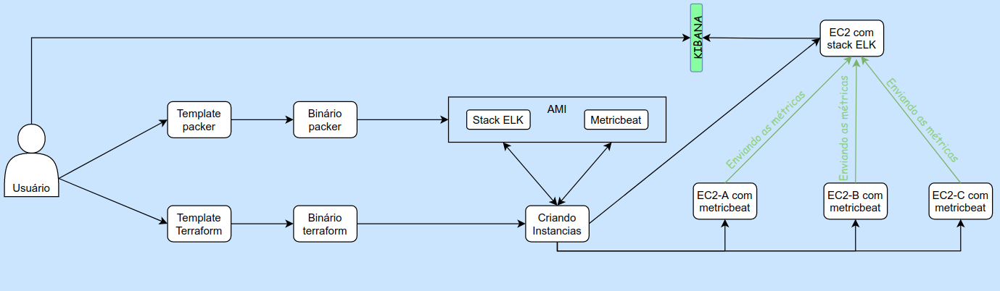
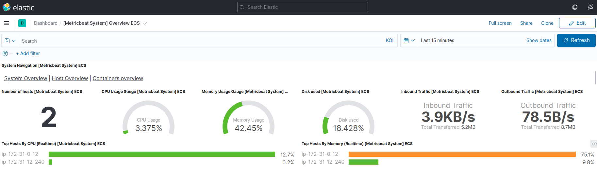
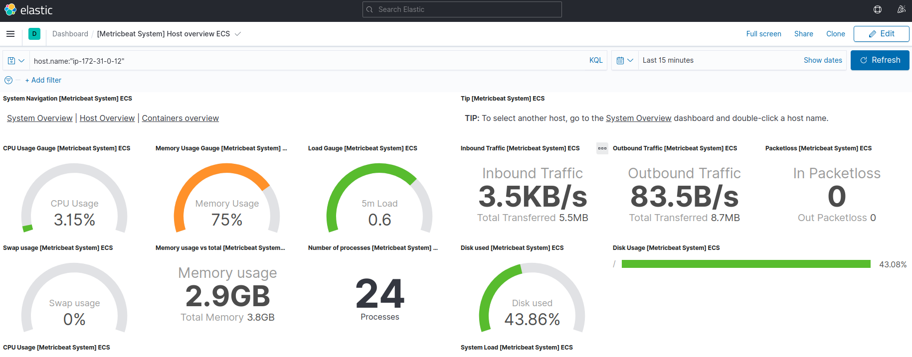
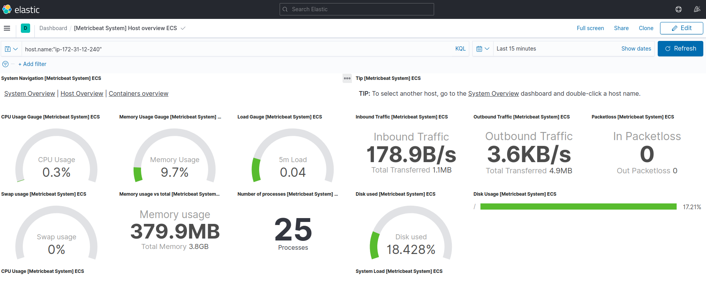

# Iac

## Objetivo do projeto

Esse projeto tem a intenção de demostra como subir uma instância com a stack elk ja instalada usando o conceito de Infrastructure as Code.

## Tecnologias usadas

- AWS;
- Terraform;
- Packer;
- Ansible;
- Stack ELK;
- Metricbeats.

## Projeto



## Executando o projeto passo a passo

1 - Criando uma _AMI_ com a stack elk e o metricbeat instalado;

- Entre na pasta _AMI_ e execute o seguinte comando:
```shell
packer validate packer/
packer build packer/
```

Esse comando irá criar a AMI na AWS personalizada baseado nas configurações descrita dentro da pasta _packer_.

Executando esse comando o packer fara o seguinte processo:
- Criara Security Group com a porta 22 ;
- Criara uma instância;
- Irá acessa a instância e instalar todas as configurações;
- Desligara a instância;
- Criara uma snapshot do disco da instância;
- Criara a imagem com a snapshot;
- Após a imagem criada irá deleta o que foi criado.

2 - Subindo uma instância com AMI criada.

Após o processo do packer ser finalizado sera possivel encontra no log o id da _AMI_ criada. 

É necessario pega esse nome e coloca no paramentro ```inst_AMI ``` dentro do arquivo ```terrafile.tf```.

```
inst_AMI = "id_da_AMI_criada"
```
- Depois de coloca o id, na pasta onde se encontra o ```terrafile.tf``` execute o seguinte comando para criar uma nova instância:

```shell
terraform init
terraform plan
terraform apply
```


Com esse comando o terraform irá criar uma nova instância baseado na AMI que o packer criou.

Essa instância subirá com a stack ELK e com monitoria para os recursos da maquina, cpu, memoria, processos e etc.

## Resultado

### Instância com a stack ELK



### Instâncias com metricbeat
Instância A



Instância B

